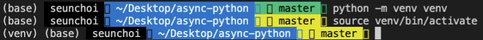

# Chapter01. 첫 시작

- 같은 프로그램이라도 동시성 프로그래밍을 사용하면 성능에 훨씬 이롭다
- 어떤 상황에서 어떻게 코드를 설계하는지 알아봄

## 동시성과 병렬성

- concurrency / at the same time로 각각 다르게 해석됨
- 동시성 프로그래밍
    - 클라이언트와 서버간 통신
    - 시스템 디스크 파일 읽기/쓰기
    - 데이터베이스 쿼리 작업
    - API 사용
- 병렬설 프로그래밍
    - 비디오, 오디오 또는 이미지 처리
    - 컴퓨터 비전
    - 머신러닝
    - 딥러닝

프로젝트별 환경을 다르게 구성해야함

- venv, conda, pipenv 등등 다양한 툴이 있음

가상환경 생성

```
python -m venv venv
```

가상 환경 활성화

```
source venv/bin/activate
```



가상 환경 비활성화

```
deactivae
```

## Linter와 Formatter를 사용하여 생산성을 높이는 개발환경 구축

format 설정


파이썬은 인터프리터 언어이기 때문에 인터프리터 설정을 잘 해줘야함

컴파일 언어와 인터프리터 언어는 해당 함수가 잘못되어도 호출을 안하면 실행을 안하기 때문에 어디서 잘못 되었는지 알기가 어려움

⇒ 이를 방지하기 위해 Linter라는 개념이 필요함


## Python의 패키지 매니저 PIP 명령어 정리와 사용

패키지 설치 및 삭제를 위한 외부 라이브러리 관리 툴

- 패키지 설치 및 업그레이드
    
    ```
    pip install flask
    pip install pip --upgrade
    ```
    
- 버전 확인
    
    ```
    pip --version
    ```
    
- 설치된 패키지 정보 확인
    
    ```
    pip freeze
    ```
    
    
    
- 설치한 패키지 삭제
    
    ```
    pip uninstall flask
    ```
    
- 설치한 패키지 정보 export
    
    ```
    pip freeze > requirements.txt
    ```
    
    ```
    black==22.8.0
    click==8.1.3
    flake8==5.0.4
    Flask==2.2.2
    importlib-metadata==4.12.0
    itsdangerous==2.1.2
    Jinja2==3.1.2
    MarkupSafe==2.1.1
    mccabe==0.7.0
    mypy-extensions==0.4.3
    pathspec==0.10.1
    platformdirs==2.5.2
    pycodestyle==2.9.1
    pyflakes==2.5.0
    toml==0.10.2
    tomli==2.0.1
    typing_extensions==4.3.0
    Werkzeug==2.2.2
    zipp==3.8.1
    ```
    
    - 개발자가 설치한 모듈을 알 수 있음
    - 다른 개발자가 해당 내용을 보고 같은 가상환경을 구성할 수 있음
- requirements.txt을 보고 그대로 환경 구성
    
    ```
    pip install -r requirements.txt
    ```
    
- 특정 버전의 패키지 다운로드
    
    ```
    pip install "패키지~=3.0.0"
    ```
    

flask app 실행

```python
from flask import Flask

app = Flask(__name__)

print(app)
```

