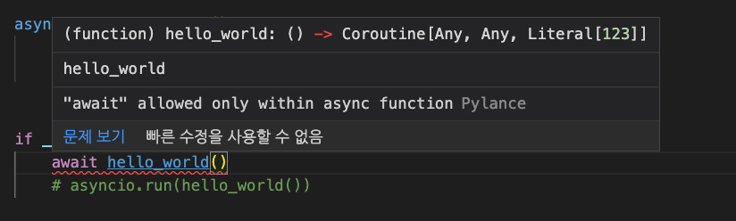

# Chapter02. 파이썬 코루틴과 비동기 함수

## I/O 바운드 & CPU 바운드, 블로킹

### CPU 바운드

- CPU의 연산에 의해 프로그램이 느려지거나 중단되는 것
- 복잡한 수학 수식을 계산하는 경우 발생할 수 있음

```python
def cpu_bound_func(number: int):
    total = 1
    arrange = range(1, number + 1)
    for i in arrange:
        for j in arrange:
            for k in arrange:
                total *= i * j * k

    return total

if __name__ == "__main__":
    result = cpu_bound_func(50)
    print(result)
```

### I/O 바운드

- 프로그램이 실행될 때 I/O에 의해 속도가 제한되는 것
- CPU의 연산때문에 멈춘게 아니라 사용자가 입력값을 넣지 않아 프로그램이 멈추는 것

```python
def io_bound_func():
    print("값을 입력해주세요.")
    input_value = input()
    return int(input_value) + 100

if __name__ == "__main__":
    result = io_bound_func()
    print(result)
```

### 네트워크 I/O 바운드

- 서버때문에 멈추는 경우 **네트워크 I/O 바운드** 라고 하기도 함

```python
pip install requests
```

```python
import requests

def io_bound_func():
    result = requests.get("https://google.com")
    return result

if __name__ == "__main__":
    result = io_bound_func()
    print(result)
```

블로킹 : 바운드에 의해 코드가 멈추는 현상이 발생한 것

논블로킹 : 바운드에 의해 코드가 멈추지 않는 것

## 동기 vs 비동기

- 동기 : 코드가 반드시 작성된 순서로 작동된다
- 비동기 : 코드가 반드시 작성된 순서로 작동되지 않을 수 있다 ⇒ 코루틴 함수

비동기 코드

```python
async def delivery(name, mealtime):
    print(f"{name}에게 배달 완료!")
    await asyncio.sleep(mealtime)
    print(f"{name} 식사 완료, {mealtime}시간 소요...")
    print(f"{name} 그릇 수거 완료")
    return mealtime
```

```
A에게 배달 완료!
B에게 배달 완료!
C에게 배달 완료!
B 식사 완료, 3시간 소요...
B 그릇 수거 완료
C 식사 완료, 4시간 소요...
C 그릇 수거 완료
A 식사 완료, 5시간 소요...
A 그릇 수거 완료
[5, 3, 4]
5.002471923828125
```

비동기 코드를 동기적으로 작동시킬 수 있음

```python
async def main():
      await delivery("A", 5),
      await delivery("B", 3),
      await delivery("C", 4),
```

- `await`
    - 비동기 함수를 처리할 때 사용하는 키워드
    - 해당 키워드를 사용하면 `async` 비동기 함수를 동기적으로 작동시킬 수 있음 (단, 단순히 동기를 위한 키워드로 생각하면 안됨!)
    - 이를 기점으로 다른 코루틴으로 넘길 수 있음

## 파이썬 코루틴의 이해

- 루틴 : 일련의 명령
    - 메인 루틴 : 프로그램의 메인 흐름
    - 서브 루틴 : 일반적인 함수나 메소드 (하나의 진입점과 하나의 탈출점)
    - 코루틴 : 서브 루틴의 일반화된 형태 (**다양한 진입점과 탈출점**)
        - `await`로 탈출할 수도 있고 `return`으로 탈출할 수도 있음

다양한 언어가 코루틴을 지원함

[Coroutines and Tasks - Python 3.10.7 documentation](https://docs.python.org/ko/3/library/asyncio-task.html)

```python
async def hello_world():
    print("hello world")
    return 123

if __name__ == "__main__":
    await hello_world()
```



await 키워드는 async 함수 안에서 실행되어야함

### awaitable 객체

- 코루틴 함수는 await라 다른 코루틴 함수에서 기다릴 수 있음
- `asyncio` 패키지는 프로그램을 블락 시킴
- `asyncio.create_task`
    
    아래 두 표현이 같은 표현임
    
    ```python
    async def main():
    	task1 = asyncio.create_task(delivery("A",2))
    	task2 = asyncio.create_task(delivery("B",2))
    ```
    
    ```python
    async def main():
    	await delivery("A",2)
    	await delivery("B",2)
    ```
    
- `asyncio.gather`
    
    ```python
    await asyncio.gather(
            delivery("A", 5),
            delivery("B", 3),
            delivery("C", 4),
        )
    ```
    
    - awaitable 객체를 `asyncio.gather` 메소드로 concurrency하게 실행함
    - 병렬적으로 수행되는 것은 아님 (동시성과 병렬성은 다른 개념)

## 파이썬 코루틴 활용

[Advanced Usage - Requests 2.28.1 documentation](https://requests.readthedocs.io/en/latest/user/advanced/)

```python
session = requests.Session()
session.get(url)
session.close
```

```python
with requests.Session() as session:
    session.get(url)
```

위의 코드와 밑의 코드는 같은 코드

[aiohttp](https://docs.aiohttp.org/en/stable/)

버전은 3.7.3버전을 사용

```python
pip install aiohttp~=3.7.3
```

`await`를 쓰려면 해당하는 영역에서 `async`를 사용해야함