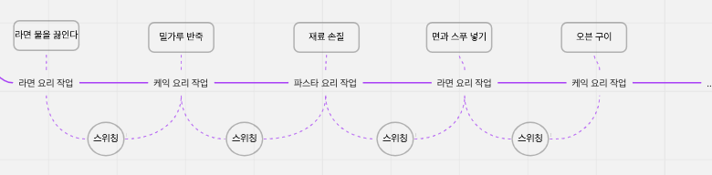

# Chapter03. 파이썬 멀티 스레딩과 멀티 프로세싱

## 컴퓨터 구조와 운영체제 기본

### 컴퓨터 구성 요소

- CPU
- 메모리
- 입출력 장치
- 시스템 버스

### 운영체제(OS)

: 컴퓨터 시스템을 관리하고 운영하는 소프트웨어 (ex. Ubuntu, Linux, MacOS, WindowOS 등등)

- 운영체제가 없는 컴퓨터는 처음 설계한 대로만 사용할 수 있는 단순 계산기임
- 운영체제가 있는 컴퓨터를 프로그램이 가능한 기계라고 함

### 프로세스

: 프로그램이 실행된 동적인 상태

- 프로그램은 HDD, SSD와 같은 저장장치에 보관되어있음
- 사용자는 어떤 이유로 프로그램 실행을 위한 버튼을 눌러서 실행함 → 해당 코드의 내용이 주메모리로 올라와서 작업이 진행됨

**⇒ 프로세스가 생성됨**

- 프로세스가 생성되면 CPU는 프로세스가 해야할 작업을 수행함

**⇒ 스레드가 생성됨**

### 스레드

: 프로세스가 생성되면 CPU는 프로세스가 해야할 작업을 수행하는데 이때 CPU가 처리하는 작업의 단위

- 하나면 싱글 스레드, 여러 개면 멀티 스레드
- 멀티 스레딩에서 스레드는 다수의 스레드끼리 메모리 공유와 통신이 가능
    - 장점 : 자원의 낭비를 막고 하나의 메모리를 공유하여 효율성 향상
    - 단점 : 한 스레드에 문제가 생기면 전체 프로세스에 영향을 미침
- 종류
    - 사용자 수준 스레드 : 파이썬에서는 해당 수준으로 생각하면 됨
    - 커널 수준 스레드

## 동시성 vs 병렬성

> 두 용어의 정확한 정의와 차이를 구분해야함  
동시성 - concurrency  
병렬성 - parallelism  
> 
- 동시성 (concurrency)
    - 한 번에 여러 작업을 동시에 다루는 것을 의미
    - 스위칭이 핵심임!!!
    
    
    
    - **논리적 개념**임 (멀티/싱글 스레드에서 둘 다 사용됨)
- 병렬성 (paralleism)
    - 한 번에 여러 작업을 병렬적으로(***at the same time***) 처리함
    - 자비스, 프라이데이, 캐런은 각각의 CPU코어 (스레드 단위에서 동작할 수도 있음, 저 로봇을 동작시키는 과학자는 프로세스)
    
    
    
    - 멀티 코어에서만 병렬 프로그래밍이 가능하므로 **물리적 개념**임

**⇒ 병렬성과 동시성은 공존할 수 있음**

- 파이썬에서는 멀티 스레드가 병렬적으로 수행할 수 없음 (Global Interpreter Lock)

## 파이썬 멀티 스레딩
- 비동기를 구현해야하는데 `asyncio`를 imoprt 할 수 없다면 `ThreadPoolConnector`사용 가능
- 다만 우선순위와 thread 할당에도 많은 리소스가 필요하기 때문에 왠만하면 `coroutine`을 쓰는 것을 추천함 (`asyncio`)

## 파이썬 멀티 프로세싱, GIL